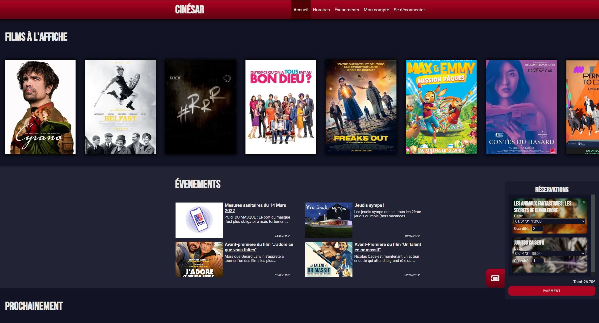

<div id="top"></div>
<br />
<div align="center">
  <h3 align="center">Cinésar</h3>

  <p align="center">
    Refonte du site https://www.cinesar-sarrebourg.fr/
  </p>
</div>

<!-- ABOUT THE PROJECT -->
## À propos



Projet de refonte du site web du cinéma de sarrebourg réalisé en plus ou moins une semaine, entièrement à but personnel (apprentissage de Redux et Firebase, ainsi que pour mon portfolio).

Ce projet utilise principalement l'API <a href="https://developers.themoviedb.org/">TMDB</a> pour récuperer les films actuellement au cinéma, ainsi que les films qui sortent prochainement. Redux est utilisé pour le systeme de réservation (qui est également persistant). Le systeme d'inscription/connexion est également fonctionnel (crée avec Firebase Authentifcation et Firestore pour le stockage des données), ce système n'a actuellement aucune utilité (la page /account n'affiche seulement que le prénom renseigné lors de l'inscription).

Aucun systeme de paiement n'a été ajouté.

### Frameworks, Librairies & APIs

Ce projet utilise:

* [React.js](https://reactjs.org/)
* [Next.js](https://nextjs.org/)
* [Styled-Components](https://styled-components.com/)
* [Firebase (Authentication et Firestore)](https://firebase.google.com/)
* [Redux (Toolkit, React-Redux, Redux-Persists)](https://redux.js.org/)
* Axios
* Moment
* [Font-Awesome](https://fontawesome.com/)
* [TMDB API](https://developers.themoviedb.org/)

<p align="right">(<a href="#top">back to top</a>)</p>


## Getting Started

First, run the development server:

```bash
npm run dev
# or
yarn dev
```

Open [http://localhost:3000](http://localhost:3000) with your browser to see the result.

You can start editing the page by modifying `pages/index.js`. The page auto-updates as you edit the file.

[API routes](https://nextjs.org/docs/api-routes/introduction) can be accessed on [http://localhost:3000/api/hello](http://localhost:3000/api/hello). This endpoint can be edited in `pages/api/hello.js`.

The `pages/api` directory is mapped to `/api/*`. Files in this directory are treated as [API routes](https://nextjs.org/docs/api-routes/introduction) instead of React pages.

## Learn More

To learn more about Next.js, take a look at the following resources:

- [Next.js Documentation](https://nextjs.org/docs) - learn about Next.js features and API.
- [Learn Next.js](https://nextjs.org/learn) - an interactive Next.js tutorial.

You can check out [the Next.js GitHub repository](https://github.com/vercel/next.js/) - your feedback and contributions are welcome!

## Deploy on Vercel

The easiest way to deploy your Next.js app is to use the [Vercel Platform](https://vercel.com/new?utm_medium=default-template&filter=next.js&utm_source=create-next-app&utm_campaign=create-next-app-readme) from the creators of Next.js.

Check out our [Next.js deployment documentation](https://nextjs.org/docs/deployment) for more details.
